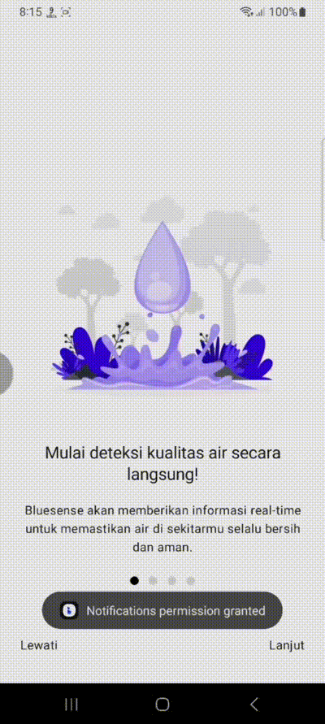
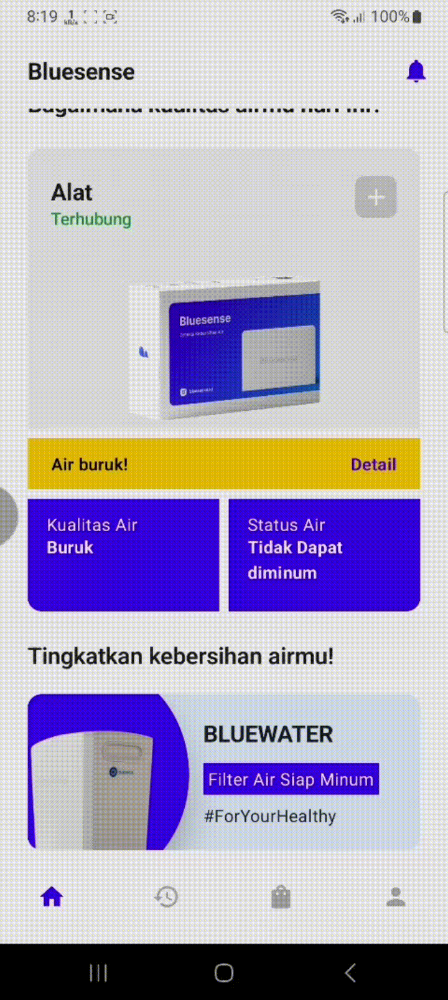

## Overview

<a href="https://bluesense.tech/bluesense/playstore">
    
</a>

Bluesense present to support sustainable development goals, particularly in clean water and sanitation.


This Application also provides services for monitoring water quality, so that people or user get full access to water quality and avoid using unsuitable water.
In addiction, there are also features that will help users get access to clean water trough the use of water filters and water providers

## Tech we use in our app

| Technology / Library Name | Usage                                                                                                                  | Documentation                                                                          |
| ------------------------- | ---------------------------------------------------------------------------------------------------------------------- | -------------------------------------------------------------------------------------- |
| Jetpack Compose           | Built modern UI with declarative approach                                                                              | [Jetpack Compose](https://developer.android.com/jetpack/compose/documentation)         |
| Firebase                  | Utilize Firebase auth and OAuth to build seamless authentication. Firebase Cloud Messaging to handle notification data | [Firebase](https://firebase.google.com/docs)                                           |
| Google ML Kit             | Utilize Google ML Kit barcode scanner to increase user experience more when adding new device                          | [ML Kit Barcode Scanner](https://developers.google.com/ml-kit/vision/barcode-scanning) |
| MQTT (Paho MQTT)          | Offers the best way to send data between IoT device and Android app with minimum latency in real time                  | [Paho MQTT](https://eclipse.dev/paho/index.php?page=documentation.php)                 |
| Retrofit                  | Handling communication between client and REST Server                                                                  | [Paho MQTT](https://eclipse.dev/paho/index.php?page=documentation.php)                 |
| ROOM Database             | To store data locally in user device                                                                                   | [Paho MQTT](https://eclipse.dev/paho/index.php?page=documentation.php)                 |

## Features

1. Monitoring water quality and status from IoT device
2. Notification water quality and status
3. Water filter and water supplier recommendation

## Snapshot

<center>
    <h2>On Boarding Screen</h2>
    
</center>
<center>
    <h2>Register</h2>
    
</center>
<center>
    <h2>Login</h2>
    
</center>
<center>
    <h2>Home (No device in account)</h2>
    
</center>
<center>
    <h2>Add Device (Scan QR)</h2>
    
</center>
<center>
    <h2>Add Device Form</h2>
    
</center>
<center>
    <h2>Monitoring water quality and status from IoT device</h2>
    
</center>
<center>
    <h2>Hitory Log</h2>
    
</center>
<center>
    <h2>Water filters and Water Supplier Recommendation</h2>
    
</center>
<center>
    <h2>Water filters Detail Page</h2>
    
</center>
<center>
    <h2>Water Filter and Supplier List Recommendations</h2>
    
</center>
<center>
    <h2>Notification (History Notification)</h2>
    
</center>
<center>
    <h2>Delete Device</h2>
    
</center>
<center>
    <h2>Logout</h2>
    
</center>
<center>
    <h2>Forgot Password</h2>
    
</center>

## How to build this project in your own machine

1. create local.properties file in root folder of this project
2. add this variables
   ```json
   MQTT_HOST=<YOUR MQTT BROKER HOST URL>
   MQTT_USERNAME=<YOUR MQTT BROKER ACCOUNT USERNAME>
   MQTT_PASSWORD=<YOUR MQTT BROKER ACCOUNT PASSWORD>
   FIREBASE_SERVER_CLIENT_ID=<YOUR FIREBASE SERVER CLIENT ID>
   FCM_ACCESS_KEY=<YOUR FCM ACCESS KEY>
   BLUESENSE_BASE_URL = "https://bluesense.tech/"
   ```
3. build the project in Android Studio
